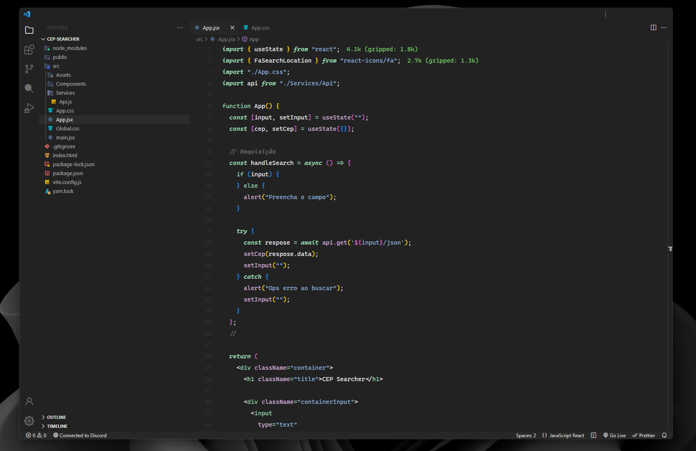

<h1 align=center>My settings for Vscode </h1>

 

 
 
<h3 align=center>Extensions </h3>

<ul>
  <li>Theme: <a href="https://marketplace.visualstudio.com/items?itemName=nichabosh.minimalist-dark">Minimal</a></li>
  <li>Icons: <a href="https://marketplace.visualstudio.com/items?itemName=Equinusocio.moxer-icons">Moxer Icons</a></li>
  <li>Product Icons: <a href="https://marketplace.visualstudio.com/items?itemName=joaopalmeiro.icons-octicons">Octicons Product Icons</a></li>
  <li>Font: <a href="https://github.com/microsoft/cascadia-code">Cascadia Code</a></li>
  <li><a href="https://marketplace.visualstudio.com/items?itemName=icrawl.discord-vscode">Discord Presence</a></li>
  <li><a href="https://marketplace.visualstudio.com/items?itemName=esbenp.prettier-vscode">Prettier</a></li>
  <li><a href="https://marketplace.visualstudio.com/items?itemName=dbaeumer.vscode-eslint">ESLint</a></li>
  <li><a href="https://marketplace.visualstudio.com/items?itemName=ritwickdey.LiveServer">Live Server</a></li>
  <li><a href="https://marketplace.visualstudio.com/items?itemName=wix.vscode-import-cost">Import Cost</a></li>
  <li><a href="https://marketplace.visualstudio.com/items?itemName=titenq.import-font">@Import-font</a></li>
  <li><a href="https://marketplace.visualstudio.com/items?itemName=shd101wyy.markdown-preview-enhanced">Markdown Preview Enhanced</a></li>
  <li><a href="https://marketplace.visualstudio.com/items?itemName=formulahendry.auto-rename-tag">Auto Rename Tags</a></li>
  <li><a href="https://marketplace.visualstudio.com/items?itemName=bradlc.vscode-tailwindcss">Tailwind CSS IntelliSense</a></li>
  <li><a href="https://marketplace.visualstudio.com/items?itemName=austenc.tailwind-docs">Tailwind Docs</a></li>
  <li><a href="https://marketplace.visualstudio.com/items?itemName=styled-components.vscode-styled-components">vscode-styled-components</a></li>
  <li><a href="https://marketplace.visualstudio.com/items?itemName=formulahendry.terminal">Terminal</a></li>
</ul>

 
<h3 align=center>Other Themes </h3>

<ul>
  <li><a href="https://marketplace.visualstudio.com/items?itemName=EliverLara.andromeda">Andromeda</a></li>
  

   
  <li><a href="https://marketplace.visualstudio.com/items?itemName=apvarun.celestial">Celestial</a></li>
  

   
   
  <li><a href="https://marketplace.visualstudio.com/items?itemName=BenjaminBenais.copilot-theme">Copilot Theme</a></li>
  

   
   
  <li><a href="https://marketplace.visualstudio.com/items?itemName=Nimda.deepdark-material">Deepdark Material Theme</a></li>
  

   
   
  <li><a href="https://marketplace.visualstudio.com/items?itemName=cdonohue.polychrome-vscode-themes">Polychrome themes</a></li>
  
  

   
  <li><a href="https://marketplace.visualstudio.com/items?itemName=wicked-labs.sequoia">Sequoia</a></li>
  

   
   
  <li><a href="https://marketplace.visualstudio.com/items?itemName=mangeshrex.uwu">UwU Theme</a></li>
  

   
   
  <li><a href="https://marketplace.visualstudio.com/items?itemName=Hermitter.oh-lucy-vscode">Oh Lucy</a></li>
  
</ul>
